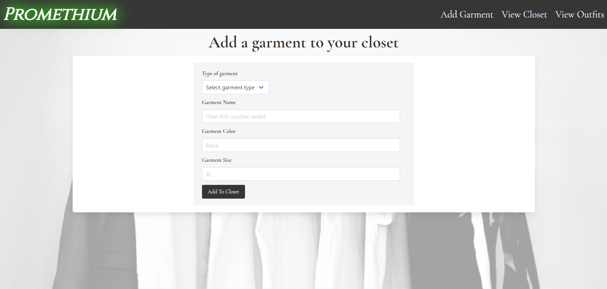
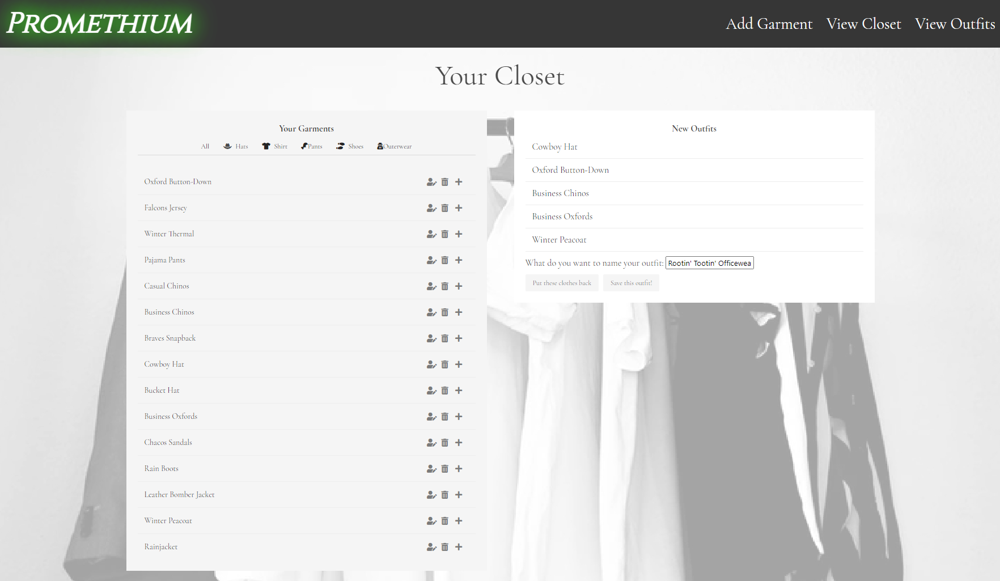
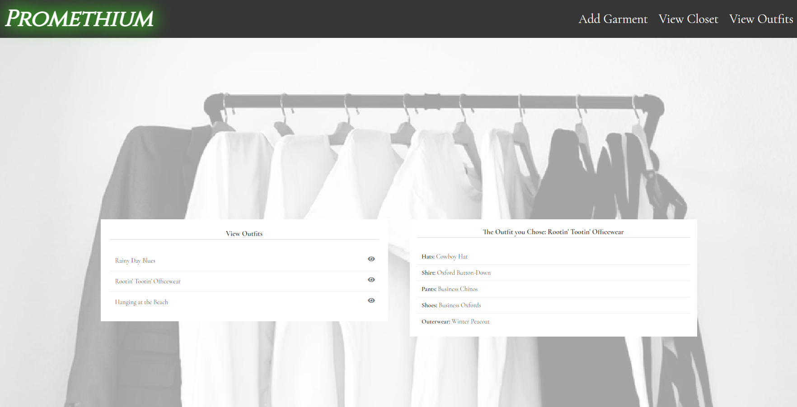

# Promethium Closet App
[](https://opensource.org/licenses/MIT)
          
 ##Table of Contents for Promethium Closet App
          
[Description](#About)
          
[Installation](#Installation)
          
[Usage](#Usage)
          
[Test Instructions](#Test)
          
[Contributing](#Contributing)
          
[Questions](#Questions)
          
[Licenses](#Licenses)
          
# About
Promethium is an app that allows users to add garments in their closets for cataloguing. After adding a garment to the database, they can then add specific garments to saved outfits that are easily accessible. Our app will help users catalogue their clothes and assist them in viewing the entire contents of their closet with ease.

## Installation

If you would like to see the site in action, the deployed and functional site can be found on Heroku here: <https://promethium.herokuapp.com/>.

Alternatively, if you would like to inspect the code and install locally, please begin by forking the repository and downloading to your own computer. You will need to run ```npm install``` but no other installations will be necessary. Create the database ```promethium_db``` in your mySQL server and edit the development password in your ```config.json``` file.
## Usage
To use the app, visit the [deployed site on Heroku](https://promethium.herokuapp.com/). Once you've arrived, you can click on the ```Add Garment``` button to begin adding to your closet. Make sure you fill out all of the required inputs and then save to your closet. 



Once saved, all of your garments are accessible under the ```View Closet``` button.Here, you can see all garments that you've created and sort them by type (hat, shirt, outerwear, etc.). You can also use the buttons to the side of each garment listed to edit, delete or add to an outfit. The edit button will redirect you to a separate page but don't worry, your outfit in progress will be waiting for you when you return. 



Once you've chosen all of your individual garments, you can name and save your outfit and view it under the ```View Outfits``` button. This will take you to another page displaying all the outfits you've saved. Simply clicking on the desired outfit will then display all of the individual garments that you saved.


## Contributing
Please reach out to one of the collaborators via Github to propose any new changes.
          
## Questions
You can find Spencer on [GitHub](https://www.github.com/spencerv86) 
You can reach me by email also at spencer.vaughan@gmail.com!

You can find Andre on [GitHub](https://www.github.com/AndreDiop) 
You can reach me by email also at itsjustandre@gmail.com 

You can find Derrick on [GitHub](https://www.github.com/DerrickHardison) 
You can reach me by email also at derrick@derrickhardison.com

You can find Eid on [GitHub](https://github.com/alsharifnahas) 
You can reach me by email also at Alsharifeid@gmail.com!

## License
This project is covered under the following 
license:
[MIT](https://opensource.org/licenses/MIT)
Copyright 2021

    Permission is hereby granted, free of charge, to any person obtaining a copy of this software and associated documentation files (the "Software"), to deal in the Software without restriction, including without limitation the rights to use, copy, modify, merge, publish, distribute, sublicense, and/or sell copies of the Software, and to permit persons to whom the Software is furnished to do so, subject to the following conditions:
    
    The above copyright notice and this permission notice shall be included in all copies or substantial portions of the Software.
    
    THE SOFTWARE IS PROVIDED "AS IS", WITHOUT WARRANTY OF ANY KIND, EXPRESS OR IMPLIED, INCLUDING BUT NOT LIMITED TO THE WARRANTIES OF MERCHANTABILITY, FITNESS FOR A PARTICULAR PURPOSE AND NONINFRINGEMENT. IN NO EVENT SHALL THE AUTHORS OR COPYRIGHT HOLDERS BE LIABLE FOR ANY CLAIM, DAMAGES OR OTHER LIABILITY, WHETHER IN AN ACTION OF CONTRACT, TORT OR OTHERWISE, ARISING FROM, OUT OF OR IN CONNECTION WITH THE SOFTWARE OR THE USE OR OTHER DEALINGS IN THE SOFTWARE.
    
    
        